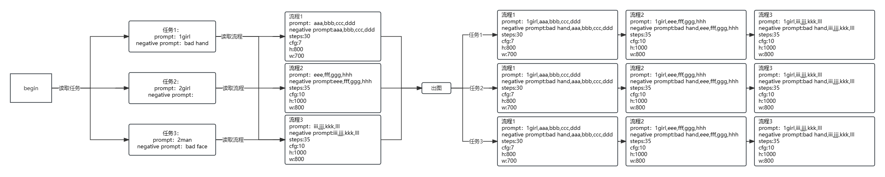

# 1. sd-workflow 介绍

该脚本为一个辅助stable diffusion批量出图的脚本 

idea来源为B站up [**Chuck_2023**](https://space.bilibili.com/3493105907009923)

该脚本的作用为一次操作批量测试多个任务，大幅节省了用户一直盯着电脑所浪费的无意义的时间

# 2. 执行流程
本脚本中将测试任务分为任务和流程两个部分，流程部分放的是几份固定的基础参数，任务部分放的是一些需要改动的参数，总的执行流程如下图


# 3. 使用方法
文件格式见实例[sample](sample)文件夹

需要一个task.txt文件和一个process文件夹，process文件夹中有多个文本文件，每个文件对应一个流程（process）
## 3.1 命令行调用命令
命令行调用命令
```shell
python process.py --task_path="path/to/task.txt" --process_dir="path/to/process_dir" --output_root="path/to/output"
```
## 3.2 脚本调用
不会调用命令的使用process.ps1文件，右键编辑，修改以下路径内容
```powershell
$task_path="sample/task.txt"
$process_dir="sample/process"
$output_root="output"
```
右键运行

# 4. 更新内容
- [x] 添加换行功能
- [x] 添加注释功能
- [ ] 不同task指定不同process